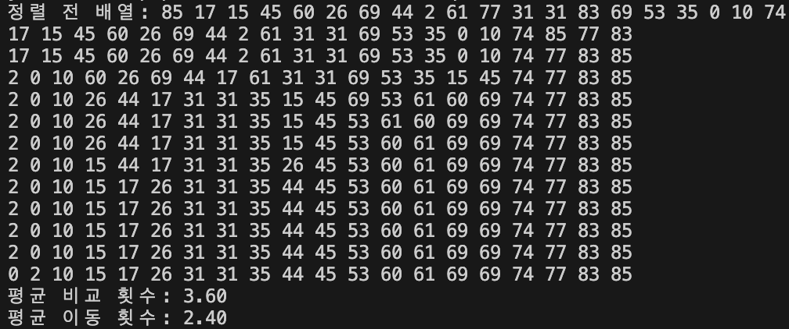

# 설명
1. swap함수
2. 분할 함수(partition)
    * 배열의 끝 인덱스를 저는 피벗으로 잡고 시작했습니다.
    * 비교해가면서 피벗보다 현재 요소가 작으면 교환하는 식으로 내려가는 구조로 짰습니다.
3. 퀵정렬(반복적 방법)
    * 스택 사용해서 하나씩 빼내는 방식으로 반복적 방법을 수행하였습니다.
4. 메인
    * 0-99 사이 난수 생성해서 배열에 넣고 퀵정렬 수행
    * 비교횟수, 이동횟수 변수를 퀵 정렬에 전달해서 정렬이 이뤄질때마다 해당 변수 횟수를 증가시키도록 설정
    * 평균값 내서 출력

# 퀵 정렬
